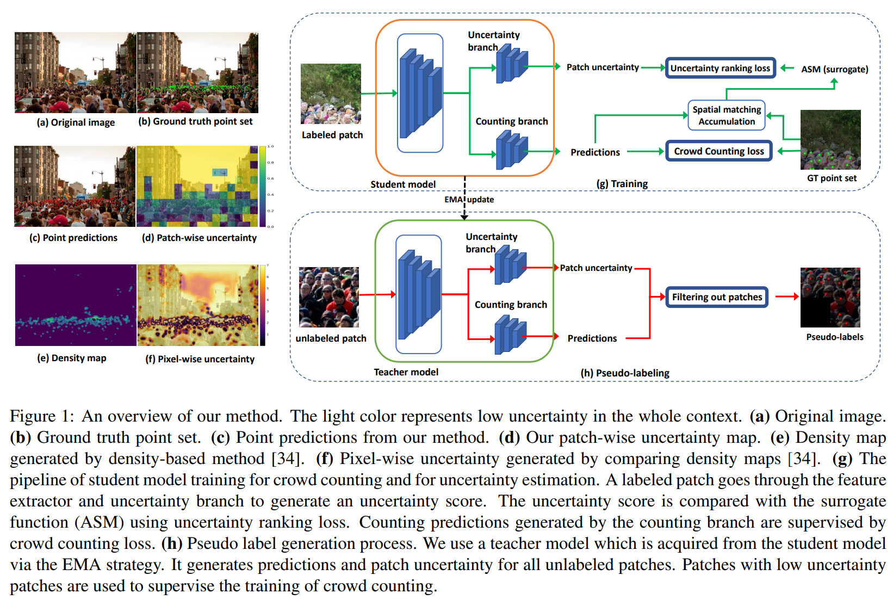

# Calibrating_count

The code for ICCV2023 paper: [Calibrating Uncertainty for Semi-Supervised Crowd Counting](https://arxiv.org/abs/2308.09887)

Semi-supervised crowd counting is an important yet challenging task. A popular approach is to iteratively generate pseudo-labels for unlabeled data and add them to the training set. The key is to use uncertainty to select reliable pseudo-labels. In this paper, we propose a novel method to calibrate model uncertainty for crowd counting. Our method takes a supervised uncertainty estimation strategy to train the model through a surrogate function. This ensures the uncertainty is well controlled throughout the training. We propose a matching-based patch-wise surrogate function to better approximate uncertainty for crowd counting tasks. The proposed method pays a sufficient amount of attention to details, while maintaining a proper granularity. Altogether our method is able to generate reliable uncertainty estimation, high quality pseudolabels, and achieve state-of-the-art performance in semisupervised crowd counting.

<p align="center"> 

</p>

### 1. Environment setup ###
Using conda:

conda env create -f crowd_test.yml

### 2. Preparing dataset for ShanghaiTech Part-A ###

Download the ShanghaiTech Part-A dataset.

makedir part_A

move data into folder part_A 

    .
    ├── ...
    ├── part_A                   
    │   ├── train_data          
    │   ├── test_data        
    │   └──               
    └── ...

makedir part_A/uncertain_data

makedir part_A/uncertain_test

makedir part_A/uncertain_data_5

makedir part_A/uncertain_data_10

makedir part_A/uncertain_data_40

python patch_gen_A.py # crop whole images into little patches.

python patch_move.py # move cropped patches into corresponding folders


### 2. Training and evaluating on ShanghaiTech Part-A ###
```
python train_semi_A.py --data_root ../CrowdCounting-P2PNet/part_A/  \\
   --dataset_file SHHA_partial  \\
   --epochs 1000  \\
   --lr_drop 3500   \\
  --output_dir ./res/SHHA/logs  \\
   --checkpoints_dir ./res/SHHA/weights   \\
  --tensorboard_dir ./res/SHHA/logs   \\
  --lr 0.0001   \\
  --lr_backbone 0.00001  \\
   --batch_size 8   \\
  --eval_freq 1  \\
   --gpu_id 1  \\
   --un_weight 0.3  \\
   --end_pro 0.4  
```

end_pro here is the confidence threshold (1-uncertainty)

